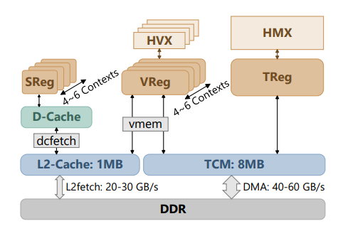

背景：把算术强度放进 Roofline 图 。「算术强度低」这句话可以画成一张图，从而变成可定量的判据。Roofline 模型把硬件抽象成两条边界：横轴是算术强度 I（FLOPs/Byte），纵轴是可达到的浮点吞吐。

图示讲解一下 Roofline 模型的核心概念


---

## 一、Roofline 图的基本结构

```
可达到的性能 (FLOPs/s)
    ^
    |        ___________________ 算力屋顶 (Peak FLOPS)
    |       /
    |      /           ← 计算密集区（受算力限制）
    |     /
    |    /    ← 拐点 (Ridge Point)
    |   /
    |  /
    | / ← 访存密集区（受带宽限制）
    |/___________________________> 算术强度 I (FLOPs/Byte)
    0
```

**横轴**：算术强度 I = 总浮点运算次数 / 总访存字节数（单位：FLOPs/Byte）
**纵轴**：可达到的浮点吞吐（单位：FLOPs/s）
**两条边界**：
- **斜线**：带宽天花板，斜率为峰值带宽 ${B_{\text{peak}}}$，公式为 $I\times B_{\text{peak}}$
- **水平线**：算力天花板，即芯片的理论峰值 $F_{\text{peak}}$

---

## 二、拐点的意义

两条线的交点称为 **拐点（Ridge Point）**：
$$I_{\text{ridge}} = \frac{F_{\text{peak}}}{B_{\text{peak}}}$$

以 H100 SXM（BF16 稠密）为例：
- $ F_{peak} \approx 990 \, \text{TFLOPs/s} $
- $ B_{peak} \approx 3.35 \, \text{TB/s} $

$$ I_{ridge} = \frac{990}{3.35} \approx 295 \, \text{FLOPs/Byte} $$

**解读**：
- 如果你的算法算术强度 **低于 295** → 被带宽卡住（访存密集）
- 如果你的算法算术强度 **高于 295** → 被算力卡住（计算密集）

---

## 三、LLM 推理两个阶段在图上的位置

```
可达到的性能 (FLOPs/s)
    ^
    |        ___________________ 990 TFLOPs/s (算力屋顶)
    |       /|             ★ Prefill (I ≈ 1000+)  ← 计算密集，在屋顶附近
    |      / |
    |     /  |
    |    /   |
    |   /    |拐点 I=295
    |  /     |
    | / ★ Decode (I ≈ 1)  ← 访存密集，深陷斜线
    |/__________________________________> 算术强度 I
    0   1    295                   1000+
```

**Prefill 阶段**（处理 prompt）：
- 计算：矩阵 × 矩阵（batch 大）
- 算术强度高（I ≈ 几百到几千）
- 工作点在屋顶水平段 → **计算密集**，GPU 算力是瓶颈

**Decode 阶段**（逐个生成 token）：
- 计算：矩阵 × 向量（batch=1）
- 算术强度极低（I ≈ 1）
- 工作点在斜线上 → **访存密集**，显存带宽是瓶颈

---

## 四、批处理如何移动工作点

```
可达到的性能 (FLOPs/s)
    ^
    |        ___________________
    |       /|
    |      / |
    |     /  |
    |    /   |
    |   /    |     拐点
    |  /     |
    | / ★ B=4
    |/★ B=1
    +----------------------------> 算术强度 I
    0  1  4               295
```

Decode 的算术强度 **大致正比于批大小 B**：
- B=1：I ≈ 1（每加载 2 字节权重做 1 次乘加）
- B=4：I ≈ 4
- B=16：I ≈ 16

**权重只加载一次，却可以同时服务批内所有请求**，所以分子（FLOPs）随 B 增长，分母（权重访存量）几乎不变。加大 batch 就是把工作点沿着斜线向右推，逼近拐点——这就是连续批处理能大幅提升吞吐的第一性原理。

代价是：批越大，单个请求的 TPOT（每输出词元时间）越长，因为要等同批的其他请求。

---

## 五、Roofline 图告诉我们什么

| 结论 | 解释 |
|---|---|
| Decode 天生访存密集 | 算术强度比拐点低两个数量级，算力完全浪费 |
| Prefill 天生计算密集 | 算术强度远超拐点，带宽不是问题 |
| 批处理本质是换瓶颈 | 把 decode 从斜线推到水平段，用延迟换吞吐 |
| 量化直接降低分母 | 权重从 FP16（2 字节）→ INT4（0.5 字节），算术强度翻 4 倍 |
| 投机解码改变斜率 | 用小模型生成草稿、大模型验证，等效提高了算术强度 |

---

## 六、一句话总结

> Roofline 图就是一个坐标轴：横轴是你"每读一次数据能干多少活"，纵轴是"实际跑多快"；
> 如果活太少（算术强度低），你就被数据搬运速度卡住，算力再高也白搭——这就是 decode 阶段的核心困境。

[End]
---
---

## Q： 显存带宽指什么？
Q: H100 SXM 为例，BF16 稠密峰值约 990 TFLOPs/s、显存带宽 3.35 TB/s。 这个显存带宽 是指 将数据 从哪里 搬到哪里（应该是 计算单元能直接操作的存储区域）的带宽？ 比如如果针对 QC芯片， 由于matrix运算单元 HMX只能访问片内的 VTCM， 我理解其 “显存带宽” 应该是指 将weight /KV cache从 DDR搬到VTCM的带宽。

你的理解完全正确，而且已经抓到 Roofline 里“显存带宽”的真正含义了。

## 一、H100 的 3.35 TB/s 指什么

在 H100 / 数据中心 GPU 的 Roofline 里：

- **3.35 TB/s = HBM3（片外高带宽显存）↔ 片上存储（L2 / Shared Memory / Register File）之间的带宽**
- 不是“寄存器 ↔ Tensor Core 乘加单元”的带宽（那一级快得多，~10–20 TB/s 量级，通常不画成主 Roofline 的斜率）
- 也不是“H100 ↔ 主机 DDR”的带宽（那是 PCIe/NVLink，更慢）

LLM decode 时：
- 权重和 KV cache 主要住在 **HBM**
- SM 里的 Tensor Core 不能直接吃 HBM 大块数据，要先 tile 到 **Shared Memory / Register**
- 所以瓶颈是：**“从 HBM 把数据搬上来”够不够快**

书上写：
> decode 每加载 2 字节 BF16 权重只做 2 FLOPs，算术强度 ≈ 1

这里的“加载”默认就是从 HBM 加载。

内存层次可以这么看：

```
HBM 80GB @ 3.35 TB/s
  ↓
L2 50MB @ 更高
  ↓
Per-SM Shared Memory/L1 @ ~19 TB/s
  ↓
Registers / Tensor Core 输入
  ↓
FMA / MMA 计算
```

Roofline 的“memory roof 斜率 = 3.35 TB/s”，度量的是**最外层大内存到计算域的搬运**，因为工作集（模型权重、KV cache）放不进片上，必须反复从 HBM 读。

---

## 二、放到 Qualcomm / Hexagon NPU 上

你说得对：

- HMX 只能直接访问 **VTCM / TCM**（片上紧耦合内存）
- 权重、KV cache 最初在 **DDR（片外）**
- 所以 NPU 版 Roofline 的“显存带宽”应该换成：

> **DDR → TCM/VTCM 的 DMA 带宽**

而不是“TCM → HMX 寄存器”的带宽（那一级很快，不是瓶颈）。

Snapdragon Hexagon NPU 典型数字是：
- DDR → TCM：DMA 约 **40–60 GB/s**.（T-MAN [arxiv:2511.11248](https://arxiv.org/pdf/2511.11248)）

  - 图1. dragon8_NPU Arch 图


- TCM → HMX：很快，按 tile（如 32×32 FP16 = 2KB）喂入，不是系统级瓶颈
- HVX/HMX gather 也只能对 VTCM 做，不能直接对 DDR 做


所以如果你给 QC NPU 画 Roofline：

```
x 轴：算术强度 = FLOPs / Byte(从 DDR 搬进 TCM 的字节数)
y 轴：可达 TOPS
memory roof 斜率 ≈ DDR→TCM DMA 带宽（几十 GB/s）
compute roof   ≈ HMX 峰值 TOPS（如 45 TOPS）
ridge point    ≈ 45e12 / 50e9 ≈ 900 FLOPs/Byte
```

而 GPU 的 ridge point 是：
```
990e12 / 3.35e12 ≈ 295 FLOPs/Byte
```

两者思路完全一样：**Roofline 的“带宽”永远取“离计算单元最近、但装不下工作集的那层外存 ↔ 片上计算域”的带宽。**

---

## 三、一句话总结

- H100 的 3.35 TB/s：**HBM ↔ SM/片上存储**
- QC NPU 的对应量：**DDR ↔ VTCM/TCM（DMA）**
- TCM ↔ HMX 寄存器、Register ↔ Tensor Core 这种“片内最后一级”不算 Roofline 主带宽
- 规则统一：
  > Roofline 里的 bandwidth = “大模型权重/KV 必须从哪层外存搬进计算单元能直接用的内存”的带宽

如果你愿意，我可以把“H100 / A100 / Snapdragon NPU / 端侧 CPU”的 Roofline 参数表（峰值算力、外存带宽、ridge point、LLM decode 工作点）整理成一张对照图。

[End]
---

Q: H100 SXM 为例，BF16 稠密峰值约 990 TFLOPs/s、显存带宽 3.35 TB/s。 这个显存带宽 是指 将数据 从哪里 搬到哪里（应该是 计算单元能直接操作的存储区域）的带宽？

A: 你的理解方向是正确的，但需要结合 GPU 的存储层次来精确定义。

## 一、H100 的“显存带宽”指的是什么

文中的 3.35 TB/s 是指 **HBM（High Bandwidth Memory，高带宽显存）到 GPU 计算核心（SM/CUDA Core/Tensor Core）的带宽**。

具体路径是：

```
HBM（显存） ── 3.35 TB/s ──→ SM 上的寄存器 / Shared Memory（计算单元可直接操作）
```

也就是说，**“显存带宽”指的是从 HBM 芯片到 GPU 片上存储（L1/Shared Memory/寄存器）的数据搬运速率**。

---

## 二、GPU 存储层次与带宽

```
寄存器 (Register)          <── 零延迟，直接操作
    ↑
Shared Memory / L1 Cache  <── 约 10~20 TB/s（片上 SRAM）
    ↑
L2 Cache                  <── 约 5~10 TB/s
    ↑
HBM（显存）               <── 3.35 TB/s（H100 SXM）
    ↑
Host Memory（CPU 内存）   <── PCIe 约 64 GB/s
```

Roofline 图中的 **B_peak** 指的是最慢的那一跳中、计算单元最常访问的那一层——在 GPU 推理场景下，就是 **HBM → SM** 的带宽。因为模型权重和 KV cache 主要存放在 HBM 中，每次计算都需要把它们读到片上。

---

## 三、与 QC 芯片的类比

你对 QC 芯片的理解完全正确，可以做精确映射：

| 层级 | GPU（H100） | QC（如某 AI 芯片） |
|---|---|---|
| 最外层存储 | HBM（3.35 TB/s） | DDR（如 512 GB/s） |
| 片上高速存储 | Shared Memory / Register | VTCM（Vector/Tensor Core 本地内存） |
| 计算单元 | SM / Tensor Core | HMX / Vector Core |
| **关键带宽** | **HBM → SM** | **DDR → VTCM** |
| Roofline 中的 B_peak | HBM 带宽 | DDR 到 VTCM 的有效带宽 |

所以你的理解是对的：对于 QC 芯片，Roofline 图中的横轴算术强度 I = FLOPs / Byte，分母中的 Byte 应该算 **从 DDR 搬运到 VTCM 的字节数**，因为这是推理中最慢的那段数据通路。

---

## 四、为什么不是 L2 Cache 或 Shared Memory 的带宽

Roofline 模型关心的是**支配性能的那个瓶颈**：

- 如果数据已经在 Shared Memory 里了，那访问它很快（~10 TB/s），不是瓶颈
- 如果数据在 HBM 里，每次都要走 3.35 TB/s 的通路，这才是卡住的地方
- 模型权重和 KV cache 太大，不可能全部塞进 Shared Memory，所以绝大多数访问都要走 HBM

因此 Roofline 图的 B_peak 取的是 **最常走的、最慢的那条外部存储到计算单元的路径**。

---

## 五、一句话回答你的问题

> 文中的 3.35 TB/s 是指 **HBM（显存颗粒）到 GPU 计算核心（SM）之间的数据搬运带宽**。
> 对应到 QC 芯片，就是你理解的 **DDR 到 VTCM 的带宽**。
> Roofline 图取这条带宽，是因为模型权重和 KV cache 放在这里，每次计算都要从这层搬，它决定了访存密集操作的性能上限。